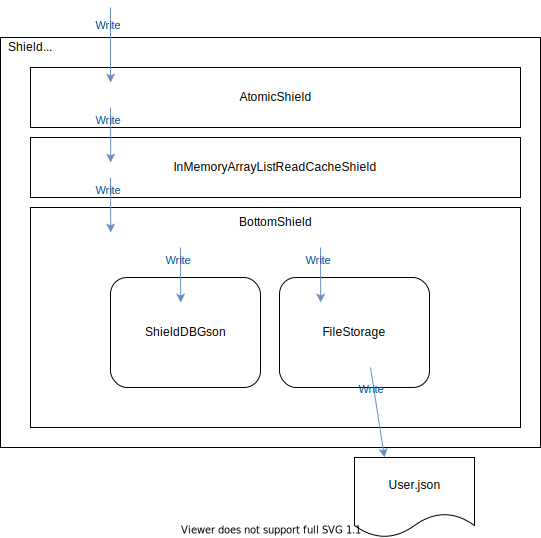

# Developer Getting Started

## Project goals & philosophy

The goal of this project is to provide a simple way to access data collection stored as JSON (maybe other format in the future, but no plan for now).

As accessing JSON backed data is pretty usual, manipulating List collection in Java is pretty usual too, so I think a custom List implementation is the best choice here.

I think it's important to think about performance (reading files on hdd/ssd is very slow compared to reading in memory objects), so ShieldDB should provide some control over the way read/write are done. As much as possible I want to avoid reflection usage for performance and compatibility with GraalVM (with native-image in mind).

The last point is I want no mandatory dependency. Everything should be shippable as plain java without any dependency. This does not mean we cannot use external tools for development or for json serialization/deserialization, but as external package only, this way we can replace them with any other implementation and match any use case.

## Project architecture

### Definitions

- **Mappers** are classes that implements ShieldDBJsonMapper interface. These classes are used to map java object to json string and back.
- **Storage** are classes that implements ShieldDBStorage interface. These classes are used to to manage the read/write of the json file.
- **Shield** are pretty much java.util.List implementations. To be precise they are classes that implements ShieldDBShield interface (itself extending List interface). The goal of one shield is to manipulate data before they are write in the file or give to the user.
- **ShieldDB** is the name of this project but also the name of the List style API to access your json data.

### Shields

As says in definitions part, shield are pretty much java.util.List implements. We can say the goal of a shield is to protect the json file access. A very basic ShieldDB instance will use no shield, in this case the json file will be accessible with no limitation, read and write for each read/write access to the ShieldDB data. A shield will hide the file access to add some behavior like read caching (InMemoryArrayListReadCacheShield), ensure only one thread will read/write the ShieldDB (AtomicShield) or ensure the ShieldDB can only be read (ReadOnlyShield and SilentReadOnlyShield). We can imagine any kind of shields. For now the library only provide few shields, but it's very easy to create one, and to share generic ones!

### IoC for mapper/storage/shield

As explain in the Project goals & philosophy part, there is no mandatory dependency. To achieve this, pretty all part of the ShieldDB instance is used through inversion of control (IoC), and you must provide mapper, storage and shields you want when you create a new ShieldDB. This way you can use any json mapper, any storage and any shield.

It's very important, particularly for mapper. For now there is only one official mapper -- the ShieldDBGson -- but you can provide your own one, for example you can provide the one your framework use to avoid having two json lib used in your project.

## Typical ShieldDB instance schema

Consider the following code:

```java
public class User {
	private String firstname;
	private String lastname;
	private int age;
	private LocalDate birthDate;
	...
}
final List<User> userDb = ShieldDB.<User>builder()
        .shield(new AtomicShield())
		.shield(new InMemoryArrayListReadCacheShield())
		.mapper(new ShieldDBGson<User>())
		.storage(new FileStorage("User.json"))
		.build();
```

### Writing scenario

The following diagram indicate how the reading process will propagate through all classes.



When writing a data, by calling a to add(new User()) for example:
- first we will pass through AtomicShield, it will ensure one parallel access then it will delegate to the next shield
- the next shield is the InMemoryArrayListReadCacheShield, it will add the data to the cache, then pass new data to the next shield
- the next and last shield is BottomShield. This shield is the only one that is mandatory, this shield start to read User.json file using the FileStorage class, then convert the json string to a java Collection using the ShieldDBGson mapper to be able to manipulate it. It will add the new data to this collection, them serialize the collection to a json string with the ShieldDBGson mapper, and replace the User.json file content with the previously serialized collection.

### Reading scenario

With the same ShieldDB instance, reading will be fast. Because the InMemoryArrayListReadCacheShield will keep an in memory copy of the User.json collection, when calling userDb.get(0) (for example), we will call the AtomicShield which will delegate to InMemoryArrayListReadCacheShield. This one will return the first data in the cache.